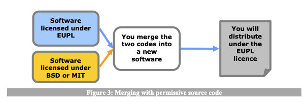

# EUPL, LGPL Licence type

### Goals

- Ensure AtB is not held liable if something doesn’t work.
- Have AtB and AtBs software and documentation Open Source
- Be able to use other work with the most common licenses
- Be able to use Entur AS’s Open Source code
- Be able to use Entur AS’s secret libraries

### Non-goals

- Prevent people from making travel planning apps and making money

## Summary

| Type of project                                           | License      | Comment                                                                                                                                   |
| --------------------------------------------------------- | ------------ | ----------------------------------------------------------------------------------------------------------------------------------------- |
| SDK, Libraries not dependent on Entur                     | LGPL         | Not dependent on any EUPL-1.2, so a more permissive license can be used. Might be we won’t have this.                                     |
| Component Libraries, Design Systems, Style Guides         | LGPL         | Not dependent on any EUPL-1.2, so a more permissive license can be used.                                                                  |
| SDK based on Entur                                        | EUPL-1.2     |                                                                                                                                           |
| Documentation                                             | EUPL-1.2     |                                                                                                                                           |
| Proxy servers, middleware, BFF                            | EUPL-1.2     |                                                                                                                                           |
| Apps, CLIs, Web-apps                                      | EUPL-1.2     | All end-user consumer-based.                                                                                                              |
| Other supporting projects (like blog tools, plugins, etc) | Case by case | More permissive licenses that usually follow more conventions of the ecosystem. For instance, in the JavaScript community, MIT is common. |

## Discussion

When deciding license type for a project, there are two aspects to consider:
technical limitations and overall project goals.

Technical limitations, in this case, means our sizable direct dependencies (e.g.
bundled with our bundle). If our dependencies are non-permissive copyleft
licenses (or viral licenses), we also have to have a similar compatible license.

There is also the question of the overall project goal. Should our goal be to
enforce consumers to Open Source (viral license) or have a license that is
“easier” to work with (permissive licenses)?

### Technical limitation (dependencies)

The one dependency we cannot avoid is Entur. Our systems will be based on their
infrastructure and code. It’s worth considering what license they use and how it
affects us. Entur uses EUPL-1.2 for all of their Open Source projects. EUPL-1.2
is a copyleft license (stays “forever” the same license, and derived work must
inherit license\*) which requires attribution and disclosing source code. It
provides legal protection, preventing liability. EUPL-1.2 has an additional
compatibility clause, where you can use EUPL-1.2 for your derived work if
compatibility is required, and use other licenses. Compatible licenses include
LGPL, GPL (v2 and v3), MPL, AGPL, and others. “If required” is a key component.
From reading EUPL-1.2 license it looks like you can only use the compatibility
clause if (IFF) compatibility is required.

There are some internal libraries are unlicensed. If we are to directly use the
secret helper libraries, we have to have a license or introduce a layer for
communicating with the solution that is not SDK/code based. For instance gRPC,
HTTP, etc. We have to consider in what way we use the libraries and see how they
are licensed. It is reasonable to think that these libraries will be using
EUPL-1.2 if formalized.

It is important to remember though, virality in licensing is mostly concerned
about distribution. If we don’t distribute code with EUPL licensing, we don’t
have to inherit (with or without compatible licenses) the license type. With
licensing, there is also a concept of “reasonable distance”. This means for
instance if we use Enturs APIs with some licensing, we don’t have to use the
same license. This can also be true for libraries. If we have closed source
servers with some pipeline based API (REST, gRPC, Sockets, etc), we don’t have
to use the same license. As far as I can see, using products generated from
copyleft licenses (e.g. QR codes) won’t count as derived work and won’t impact
license choice.

Entur also has an SDK that is intended to be used bundled with distributions.
The copyleft clause comes into effect here. In our case, this is relevant for
our BFF, and clients (both native and web). This means if we want to use the SDK
directly, our license on distributed code must be EUPL license also.

The EUPL-1.2 License is “upstream” (meaning can use/link) compatible with more
permissive licenses such as MIT, BSD, etc. This means there is nothing about
EUPL which limits us from using common libraries in the React Native or web
ecosystem
(https://joinup.ec.europa.eu/collection/eupl/matrix-eupl-compatible-open-source-licences).
It is also compatible with say GPLv2 and GPLv3 licenses as EUPL-1.2 Licensed
work can be distributed with “similar” licenses if required. EUPL is similar to
GPLv3 but considered simpler
(https://joinup.ec.europa.eu/collection/eupl/news/eupl-or-gplv3-comparison-t).

Using EUPL doesn’t require consumers to inherit license unless they distribute
in any form. This means if they make applications or packages (e.g. NPM
packages) they need to use the same license (see
[Guidelines for Users and Developers](https://joinup.ec.europa.eu/sites/default/files/inline-files/EUPL%201_1%20Guidelines%20EN%20Joinup.pdf)).

**LGPL** is a GPL license that is copyleft but allows for using linked
dependencies without inheriting license type. This means you can use an LGPL
licensed work as a linked library (e.g. npm, maven, etc), even from a
proprietary solution – given that there is a clear separation between the
codebases (e.g. package manager). This is why LGPL licenses typically are used
for libraries. EUPL is compatible with LGPL if needed.

### Using copyleft with App Store

There are some cases where GPLv2 has been in conflict with the Apple App Store
model as they add some DRM features and redistributes packages
(https://www.engadget.com/2011/01/09/the-gpl-the-app-store-and-you/). But it
looks like this isn’t applicable for GPLv3 or EUPL.

### Conclusion

If we base our code on the SDK, we are required to distribute our code as EUPL
also. We could have the BFF as EUPL but our own SDK (which cannot be based on
Enturs SDK or be too similar) which has a more permissive license. This means we
cannot reuse types across different clients/solutions. Other than this, most
infrastructure code uses Enturs data from REST APIs or GraphQL and not
distributing the code directly. If we use the SDK or derive our work from it, we
must be EUPL (or compatible), if not we are free to choose. AppStore
distribution model doesn’t seem to affect us unless we choose GPLv2.

## Overall project goal

Now that we know the technical limitations we can discuss the more philosophical
goals and how we want to work with Open Source. It comes down to the question:
Do we want our License to be viral, or not?

I think the ultimate goal of this project is to reduce non-public transport in
Trøndelag county. We can have a secondary philosophical goal of maximizing FOSS
(Free and Open Source Software) usage. The question remains, if a strict
copyleft license is a requirement for this, or if a looser copyleft license like
LGPL will be easier to use but also encourage FOSS.

At least in frontend (mobile and web development), LGPL and more permissive
licenses (MIT, BSD, etc) are more common. It can be valuable conforming to more
industry-standard licenses.

## Conclusion

The EUPL-1.2 looks like an interesting license that is designed to be compatible
with other licenses but also copyleft. I think using EUPL-1.2 is a viable
option, but I think the “strict” copyleft clause can make our projects harder to
use.

I think using an even more common license by default for our libraries should be
preferred. But end products can be more viral as we want to encourage sharing
experiences. Using a library is one thing, but redistributing entire
applications is another. The latter example I think it is more important to be
copyleft. So I think using EUPL-1.2s compatibility with LGPL is interesting. As
we can maximize usage (working towards the goal of minimizing non-public
transport), but also if someone forks/redistributes our projects, they must
inherit the GPL license.

EUPL-1.2 can be a good fit for the infrastructure code. As this will be as an
end product in many ways. People can use it as APIs without inheriting license,
but if they redistribute the license should be inherited. With the compatibility
of EUPL-1.2 I think we have a good middle ground.

I think a license decision matrix should look like this:

| Type of project                                           | License      | Comment                                                                                                                                   |
| --------------------------------------------------------- | ------------ | ----------------------------------------------------------------------------------------------------------------------------------------- |
| SDK, Libraries not dependent on Entur                     | LGPL         | Not dependent on any EUPL-1.2, so a more permissive license can be used. Might be we won’t have this.                                     |
| Component Libraries, Design Systems, Style Guides         | LGPL         | Not dependent on any EUPL-1.2, so a more permissive license can be used.                                                                  |
| SDK based on Entur                                        | EUPL-1.2     |                                                                                                                                           |
| Documentation                                             | EUPL-1.2     |                                                                                                                                           |
| Proxy servers, middleware, BFF                            | EUPL-1.2     |                                                                                                                                           |
| Apps, CLIs, Web-apps                                      | EUPL-1.2     | All end-user consumer-based.                                                                                                              |
| Other supporting projects (like blog tools, plugins, etc) | Case by case | More permissive licenses that usually follow more conventions of the ecosystem. For instance, in the JavaScript community, MIT is common. |
