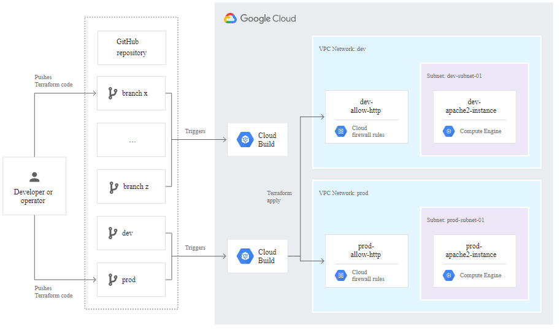

# Google Cloud Build as CI/CD

### Goals

- Manual and automatic triggers
- Language-agnostic
- Create OCI-compatible containers (preferably Docker)
- Integrate with Terraform (deployments)
- Integrate with GitHub (pull requests)

### Non-goals

## Summary

We need to decide on a platform/service for continuous integration and
continuous delivery/deployment.

This document is based on the assumption that we will be using GCP as our cloud
provider ([0002](../0002-GCP-as-cloud-provider.md)).

Given that we will start on GCP, the recommendation is to use Google Cloud Build
as our sole tool for building and deployment, and the entire infrastructure will
be described in Terraform. Using the GitOps practice, merging to e.g. the master
branch will rebuild the code, package it as a Docker container, and deploy it to
production.

## Discussion

### Continuous Integration

#### Alternatives:

- Google Cloud Build
- GitHub Actions
- CircleCI

For the CI step (building and automated tests), all of the alternatives are fine
and integrates with GitHub and Docker registries.

### Continuous Delivery/Deployment

#### Alternatives:

- None (just deploy)
- Spinnaker
- Harness

For the CD step, it’s less clear as the decision depends on how advanced we want
our deployments to be. For example, should we have the ability to do canary or
blue/green deployments? This also depends on the environment our code is running
in. For example, in GCP, Cloud Functions and Cloud Run do not support anything
other than the latest version, so you cannot say that 10% of the requests go to
the new version and 90% of the requests go to the old version. It might be
possible to do something outside these systems using Terraform. For Kubernetes,
Spinnaker and Harness have a lot of functionality that we might not need at this
point.

### Recommendation

Given that we will start on GCP, the recommendation is to use Google Cloud Build
as our sole tool for building and deployment, and the entire infrastructure will
be described in Terraform. Using the GitOps practice, merging to e.g. the master
branch will rebuild the code, package it as a Docker container, and deploy it to
production.

## Technical architecture, dependencies and components

## References

- https://cloud.google.com/solutions/managing-infrastructure-as-code
- https://cloud.google.com/kubernetes-engine/docs/tutorials/gitops-cloud-build
