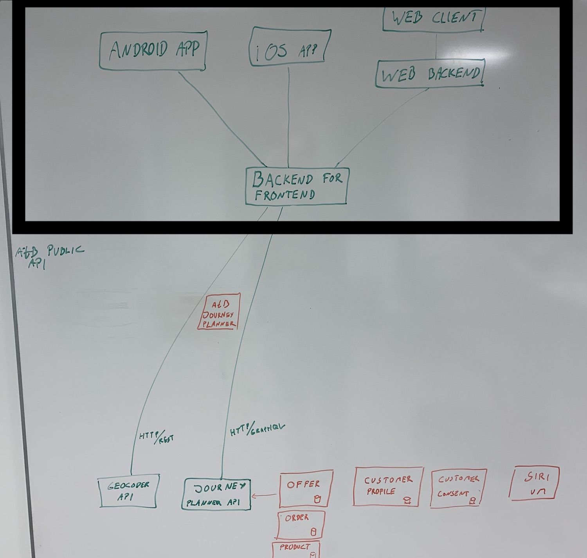

# Cross device/platform solution

### Goals

- Establish a testing platform with a quick feedback loop while testing with
  real users.
- Have the ability to collect realistic usage stats and user insight.
- Easy to install
- Establish a platform to iterate on for long term goals as well as reduce time
  to market.
- Establish internal routines for deploy
- Learn to work together and getting started creating value.

### Non-goals

- Establish de-facto solutions that should be used in all future iterations.
- Decide technology for each platform.
- Decide CI/CD for each platform.
- The technological decision for “Backend for Frontend”

## Summary

This design doc suggests developing both mobile and web applications in parallel
with the initial concept. Given the shared goals of technical exploring and user
insight, the importance of establishing feedback loops for all relevant
platforms, combined with reasonably high capacity, I think we are able to do
both. We should prioritize completeness over feature sets.

This RFC is most relevant for initial concept/MVP, but also sets precedence for
future development.

## Discussion

We have a self-inflicted deadline, January 31th, for establishing shared
ownership and enthusiasm across the organization. To do this we want to create a
working implementation of something that is useful for users. We also want to
measure actual user behavior and convert that to insight.

With such a small time frame it is reasonable to think we should focus on one
platform. I would argue that being able to establish working pipelines for all
platforms has significant value and our collective capacity is high enough to
tackle all platforms.

To reduce the amount of implementation work on each client, and to have more
flexibility to handle versioning in the API layer, we introduce a Backend for
Frontend (BFF) which is shared across all clients. This backend will handle
GraphQL requests and relay information to each client using RESTful services.
This BFF can be swapped out at a later point if we see we should use other
protocols.

I think our main goals should be to establish a line of communication with
end-users and test users on all platforms – and from a technological standpoint,
create build pipelines and deploy routines to be able to do so. This is
important for all platforms, and as such, I have a hard time prioritizing one
over the other.

To achieve this I propose at least 1 full-time resource on the Web Client
(Mikael Brevik), but focus most of our efforts in the Apps, which I think would
have the highest complexity.

### The solution solves goals:

- Establish a testing platform with a quick feedback loop while testing with
  real users.
- Have the ability to collect realistic usage stats and user insight.
- Establish a platform to iterate on for long term goals as well as reduce time
  to market.
- Establish internal routines for deploy
- Learn to work together and getting started creating value.

## Figures and diagrams

