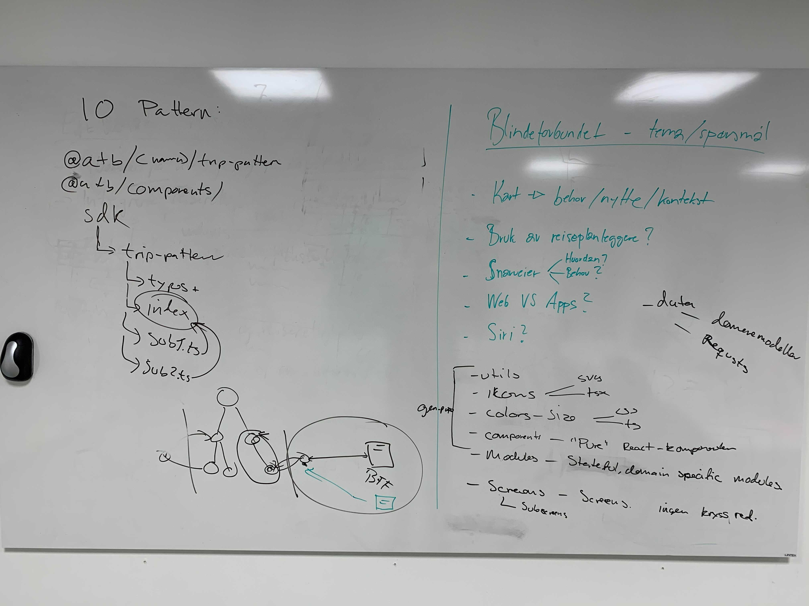

# App code architecture and patterns

### Goals

- General standardization of patterns we follow
- Make it easier for external / partial contributors to actually contribute
- Follow good practices by separating modules of code into their logical domain
- Make it easier to share code with web, or other projects where relevant

### Non-goals

- Share UI code with web or other projects
- Separate our modules into the smallest units possible

## Summary

An over-arching means of achieving these goals will be to follow a mono-repo
pattern, where some parts of the current app-code will be refactored into their
own packages. Another big change will be that the
[BFF](https://github.com/AtB-AS/atb-bff) will be moved into this mono-repo.

## Discussion

By moving to a mono-repo pattern, we hope that it will be easier to continually
distribute the app along with BFF, and share types and SDK-related things
between them. In some way, this means that the BFF is just an extension of the
app itself (which is how we philosophically think of it anyway). But the SDK
itself is something that is developed in lock-step with the BFF, and the app
itself just utilizes that SDK.

Other parts which can be shared with web, like SVGs/icons, will also be moved
into their own packages.

We will prefix packages like this with `@atb`, and try to move away from using
relative paths for resolving modules in the app-code. Also in general parts of
the app-code will have their own absolute path aliases, like components under
`src/components` will be aliased to the absolute path `components`.

### Overview

#### Packages

- `@atb/data`: SDK-code for the BFF, which the app will utilize to communicate
  with the BFF. Contains the `axios`-implementations, as well as the types which
  the BFF returns. Trying to abstract away the idea that we're communicating
  over HTTP to the BFF, even though we are. But still going to make the SDK
  extensible enough that if you need to know if the request had a certain HTTP
  status code, you can. (Discussion: Co-located with BFF? `@atb/sdk`?)
- `@atb/icons`: SVG icons and illustrations, as well as generated `tsx`-files
  for these. (Discussion: Evaluate if this only needs to be SVGs,
  `react-native-svg` will support these, but in turn this will be less flexible
  wrt. animations etc).
- `@atb/theme`: Colors and sizes, theme-related stuff to re-use. Both CSS and
  `ts`.

#### Modules in app

All of the following have absolute paths defined in the app via `tsconfig`.

- `components`: "Pure" React/RN-components, most of the behaviour and content is
  defined by props being sent into them. Relevant with products like Storybook
  etc
- `modules`: Stateful, domain specific components. Reusable across several
  screens, but can define their own behaviour and content.
- `screens`: Screens and sub-screens. Domain specific "full" components which
  have their own router/navigation paths.
- `utils`: General purpose utils, and hooks with no domain-specific behavior.

### Illustrations

