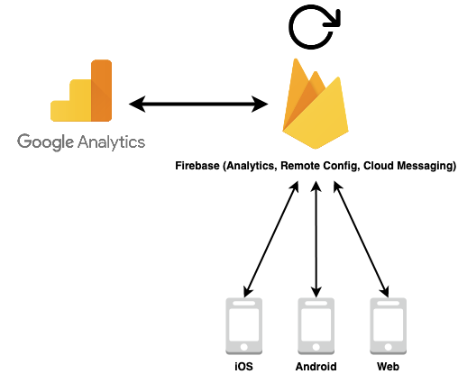

# Analytics for web and apps

### Goals

- Be GDPR-compliant, where we ask for consent for data processing, anonymise
  data to protect user privacy, and select an analytics provider to ensure safe
  handling of data movement and storage
- Track large user group behaviours, at a birds-eye view
- Preferably use the same solution for both web and app, so we have the
  possibility to measure and compare across all platforms
- Segment user groups to understand different behaviours and usage of solutions
- Understand the screen flows of our solutions, which parts are utilized and
  under-utilized
- Understand where users are stuck
- Measure the performance of our products, conversion rates
- Set user goals so we can measure objectives and key results (OKRs)
- Track which devices and operating systems are used, to know what to support
  and test
- Share analytics with the rest of the AtB organization, specifically
  marketing/customer support

### Non-goals

- Track individual person behaviour
- Capture identifiable data about individual persons
- Track everything we can capture about our users
- Sell or give away user data

## Summary

I propose using
[Google Analytics for Firebase](https://firebase.google.com/products/analytics/)
as our analytics provider, which will offer all the necessary features we need
while allowing measuring across both websites and mobile apps. Firebase has
historically been focused on mobile apps, but recently they have started
offering an "App + Web property" which links your Firebase web apps to the
Google Analytics data streams, just as with mobile apps.

This will allow us to use the same solution on all platforms and ensure that our
measurement remains consistent no matter which platform our users are utilizing.

## Discussion

Most of the analytics providers offer a similar range of services, where such
features as monitoring traffic, behaviour flows, crash reporting and A/B testing
are universally provided. Some differ in the platforms they focus on, such as
Firebase, Crashlytics and Flurry has historically focused on mobile apps, while
such services as Google Analytics and Mixpanel have been focused on websites.

The general trend today is moving towards offering a solution which allows you
to track and measure across several platforms, without necessarily mixing the
datasets. When deciding on an analytics provider, this requirement should be a
priority.

Furthermore, GDPR-compliance and support for the anonymization of user data is a
high priority requirement. Thankfully, all major analytics providers have vetted
systems and processes in place to handle these needs.

Another thing to consider is what platforms our development team, as well as our
wider organization, are already using. One common denominator here is the
Google-stack (as far as cloud services go), and specifically Google Analytics as
analytics provider for [atb.no](https://www.atb.no).

A benefit, if we decide on using the same analytics provider for our other
portals, is that it would be easier to compare the historic data from our
existing portal, with the new tracking data from our new portals. It would also
be far easier to export raw data for further analysis through GA360 and other
Google-stack offerings like BigQuery, if we decide that we need the extended
capabilities
[that GA360 offer](https://marketingplatform.google.com/about/analytics/compare/).

Sadly, as far as Google Analytics for mobile apps, the native SDKs were
deprecated in 2018, and the APIs for mobile apps tracking were turned off
in 2019. The author of this document is distinctly aware of this since he
maintained a
[Google Analytics library for React Native](https://github.com/idehub/react-native-google-analytics-bridge)
until he had to deprecate it in 2019.

This is where Firebase Analytics has picked up the torch and offered a mobile
analytics solution for several years. The Google Analytics and Firebase
Analytics solution were two distinct offerings for a while, but as expected have
been merged to be able to offer a cross-platform solution.

From late 2019, the rebranded Google Analytics for Firebase has started offering
an "App + Web property" which allows you to link your Firebase website apps to
the Google Analytics data streams. This is also possible for mobile apps, which
means Google supports a single solution that works cross-platform.

Firebase also offers quite a few other services which are quite compelling. One
such service is Firebase Cloud Messaging, which allows you to handle push
notifications across both iOS and Android apps and supports notifications in
websites. Firebase Remote Config is another compelling service which can handle
feature flags in apps, to gradually rollout new features. This also allows for
A/B testing, which in turn will interact with the analytics solution.

Lastly, as far as support for our chosen technologies, there exists a very
mature and stable solution for
[Firebase in React Native](https://github.com/invertase/react-native-firebase)
apps. This will make it easier to integrate with Firebase across different
service offerings, granted that we decide to make use of them. It is a
modularized library, which means we only have to install the services that we
need.

So, to summarize, **I propose we use Google Analytics for Firebase, for
measurement across both mobile apps and websites**. This entails using the
Firebase SDK, with different "Firebase apps" for iOS, Android and websites
created in the Firebase Console. And in turn link the data streams from Firebase
to Google Analytics, for further analysis inside Google Analytics.

In this solution, using Firebase SDKs for Analytics, Remote Config, and Cloud
Messaging would work synergistically to identify user segments through
Analytics, and allow us to test gradual rollouts and A/B-test different features
on different segments, while also allowing us to send specific push
notifications to different user segments. The Google Analytics website would be
used for analysis, while Firebase is the integration point for all platforms.
